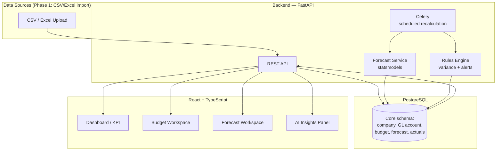
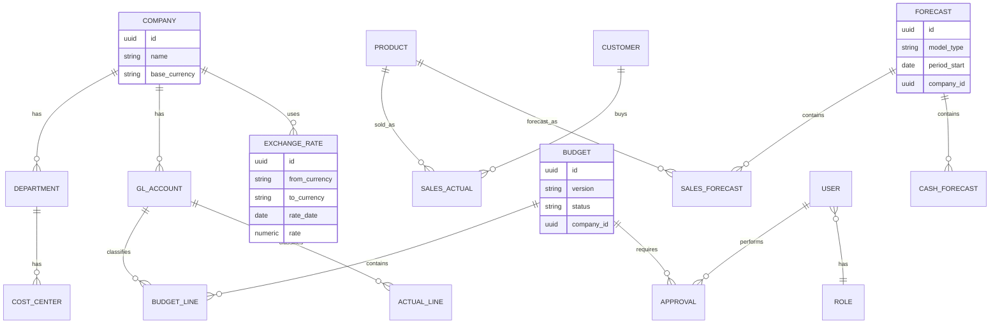

# Enterprise Finance Engine — Phase 1 Roadmap

**Forecasting & Control Platform** · Multi-company · Draft v1 · 2026-08-01

---

## 1. What we're building

A single platform that replaces scattered Excel budgets and forecasts with one connected engine: sales and cash forecasting, budget planning, cost/variance control, profitability analysis, and KPI reporting — built to scale from one company to a multi-entity group.

This document scopes **Phase 1**: the smallest set of modules that already form a complete, useful loop (forecast → budget → track → explain), plus the foundation the later phases build on. Everything from your original 15-module list is preserved below under [§6 Full module backlog](#6-full-module-backlog) so nothing gets lost — it's just sequenced.

---

## 2. Phase 1 scope

| Module | Depth in Phase 1 | Why |
|---|---|---|
| **Sales Forecasting** | Full — simple models (moving average, weighted average, exponential smoothing) with confidence intervals | Everything else (budget, cash, variance) needs a forecast to compare against |
| **Budget Planning** | Full — Revenue, Expense, and Master budget, single approval chain (Manager → Finance → CFO) | The control half of "forecasting and controlling" |
| **Cash Flow Forecast** | Full — cash in/out, rolling 12-month, driven off sales forecast + budget | Directly requested; also proves the "driver-based" architecture early |
| **Cost Controlling & Variance** | Full — actual vs. budget vs. forecast, budget consumption %, traffic-light alerts | Closes the loop: plan vs. reality |
| **Profitability Analysis** | Light — contribution margin (price − variable cost) per product/customer, computed from data the four modules above already capture | You get it almost for free once Sales + Budget exist; full marginal-costing suite (break-even, operating leverage, per-salesperson) moves to Phase 2 |
| **KPI Dashboard** | Light — a home screen surfacing 8–10 core numbers (gross margin, budget utilization, forecast accuracy/MAPE, cash runway) pulled from the four full modules | A dashboard with nothing to show is just a mockup; this version is real because the data behind it is real |
| **AI Recommendation Engine** | v0 — **rule-based**, not ML: flags variances >10%, forecast misses, and budget overruns in plain language (e.g. *"Marketing overspent budget by 18% in June"*) | Sets up the interface and the habit of reading AI-generated commentary; the NLP/anomaly-detection version depends on 12+ months of real data this phase generates, so full ML moves to Phase 3 |

Standard Costing, Marginal Costing (full suite), Scenario Planning, ML forecasting (XGBoost/Prophet/LSTM), multi-company consolidation, ERP integrations (SAP/Oracle/Dynamics), and Approval-Workflow versioning are **deferred to Phase 2–4** — not dropped. See §6.

**Rationale for this cut:** a forecasting tool with no budget to compare against, or a budget with no variance tracking, is half a product. This slice is the smallest complete loop.

---

## 3. Architecture

**Why this stack for Phase 1:**

| Layer | Choice | Note |
|---|---|---|
| Backend | Python + FastAPI | async, typed, fast to iterate |
| Database | PostgreSQL | multi-company from day one needs relational integrity + row-level scoping, not a document store |
| Forecast models | `statsmodels` / `pandas` | moving average & exponential smoothing don't need XGBoost/Prophet yet — add those in Phase 3 without changing the schema |
| Scheduled jobs | Celery + Redis | nightly recalculation, budget alert emails |
| Frontend | React + TypeScript + AG Grid + ECharts | AG Grid specifically because budgets are dense editable tables — a normal `<table>` won't hold up |
| Auth | JWT (email/password) | Entra ID / SSO is a Phase 2 item once there are multiple companies with real IT departments behind them |
| Hosting/CI | Docker + GitHub Actions | see §5 on GitHub |

---

## 4. Core data model (Phase 1 slice)

Full entity list from your original design (Product, Supplier, Inventory, Purchase, Production, Payroll, Exchange Rate, Scenario, Audit Log, etc.) stays in the target schema — Phase 1 implements the subset above; Phase 2 extends the same tables rather than replacing them, so no rework.

---

## 5. Repo & hosting: GitHub, not local-only

Per your instruction, this doesn't live as a local-only folder — it's a proper GitHub repository: **[`Habib-hh212/finance-engine`](https://github.com/Habib-hh212/finance-engine)** (public). GitHub Actions CI (lint, test, Docker build) comes once there's code worth running it against.

---

## 6. Full module backlog (all 15, sequenced)

| Phase | Modules |
|---|---|
| **Phase 1** (this doc) | Sales Forecasting · Budget Planning · Cash Flow Forecast · Cost Controlling & Variance · Profitability Analysis (light) · KPI Dashboard (light) · AI Engine v0 (rule-based) |
| **Phase 2 — Depth & Control** | Standard Costing + full variance set (material/labor/overhead) · Marginal Costing (break-even, margin of safety, operating leverage) · Full Budget suite (Zero-Based, Flexible, Rolling, Capital) · Approval Workflow with version history · Multi-company consolidation |
| **Phase 3 — Intelligence** | ML forecasting (Random Forest, XGBoost, Prophet, LSTM) · Scenario Planning ("what-if" P&L/BS/CF recalculation) · Full AI Recommendation Engine (NLP insights, anomaly detection) · Churn/demand/bad-debt prediction |
| **Phase 4 — Enterprise hardening** | ERP/system integrations (SAP, Oracle, Dynamics, QuickBooks, Xero, SQL Server) · Azure AD / SSO · Multi-currency scenario engine · Monte Carlo simulation · Full report generation (Excel/PDF/PPT) · ESG metrics · Audit trail everywhere |

---

## 7. Open decisions before Phase 1 build starts

- [x] Repo name, owner, visibility (§5) — `Habib-hh212/finance-engine`, public
- [x] Data source for Phase 1 — **manual CSV/Excel upload**. No live ERP/SAP connector yet; deferred to Phase 4 even though the user has a SAP FICO background, so it can be pulled forward later without re-architecting the import layer
- [x] Currency scope — **multi-currency from day one**. Every `Company` carries a base currency; every actual/forecast/budget line carries its own transaction currency plus the FX rate applied at that date. Full FX *scenario* modeling (§6 Phase 4) still comes later — Phase 1 just needs correct storage and conversion, not "what if the dollar moves 5%" simulation.

---

*Status: all four "full" Phase 1 modules are built end-to-end — Sales Forecasting, Budget Planning (Manager → Finance → CFO approval chain), Cash Flow Forecast (driven off both, plus manual entries), and Cost Controlling & Variance (budget-vs-actual and budget-consumption, both with direction-aware traffic-light status). 20 tests passing. Remaining Phase 1 scope: the "light" Profitability Analysis and KPI Dashboard, and the rule-based AI Engine v0 — plus the frontend and CI, which nothing has touched yet.*
