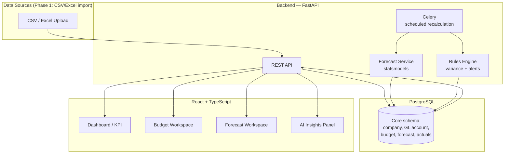

# Enterprise Finance Engine — Phase 1 Roadmap

**Forecasting & Control Platform** · Multi-company · Draft v1 · 2026-08-01

---

## 1. What we're building

A single platform that replaces scattered Excel budgets and forecasts with one connected engine: sales and cash forecasting, budget planning, cost/variance control, profitability analysis, and KPI reporting — built to scale from one company to a multi-entity group.

This document scopes **Phase 1**: the smallest set of modules that already form a complete, useful loop (forecast → budget → track → explain), plus the foundation the later phases build on. Everything from your original 15-module list is preserved below under [§6 Full module backlog](#6-full-module-backlog) so nothing gets lost — it's just sequenced.

---

## 2. Phase 1 scope

| Module | Depth in Phase 1 | Why |
|---|---|---|
| **Sales Forecasting** | Full — simple models (moving average, weighted average, exponential smoothing) with confidence intervals | Everything else (budget, cash, variance) needs a forecast to compare against |
| **Budget Planning** | Full — Revenue, Expense, and Master budget, single approval chain (Manager → Finance → CFO) | The control half of "forecasting and controlling" |
| **Cash Flow Forecast** | Full — cash in/out, rolling 12-month, driven off sales forecast + budget | Directly requested; also proves the "driver-based" architecture early |
| **Cost Controlling & Variance** | Full — actual vs. budget vs. forecast, budget consumption %, traffic-light alerts | Closes the loop: plan vs. reality |
| **Profitability Analysis** | Light — contribution margin (price − variable cost) per product/customer, computed from data the four modules above already capture | You get it almost for free once Sales + Budget exist; full marginal-costing suite (break-even, operating leverage, per-salesperson) moves to Phase 2 |
| **KPI Dashboard** | Light — a home screen surfacing 8–10 core numbers (gross margin, budget utilization, forecast accuracy/MAPE, cash runway) pulled from the four full modules | A dashboard with nothing to show is just a mockup; this version is real because the data behind it is real |
| **AI Recommendation Engine** | v0 — **rule-based**, not ML: flags variances >10%, forecast misses, and budget overruns in plain language (e.g. *"Marketing overspent budget by 18% in June"*) | Sets up the interface and the habit of reading AI-generated commentary; the NLP/anomaly-detection version depends on 12+ months of real data this phase generates, so full ML moves to Phase 3 |

Standard Costing, Marginal Costing (full suite), Scenario Planning, ML forecasting (XGBoost/Prophet/LSTM), multi-company consolidation, ERP integrations (SAP/Oracle/Dynamics), and Approval-Workflow versioning are **deferred to Phase 2–4** — not dropped. See §6.

**Rationale for this cut:** a forecasting tool with no budget to compare against, or a budget with no variance tracking, is half a product. This slice is the smallest complete loop.

---

## 3. Architecture

**Why this stack for Phase 1:**

| Layer | Choice | Note |
|---|---|---|
| Backend | Python + FastAPI | async, typed, fast to iterate |
| Database | PostgreSQL | multi-company from day one needs relational integrity + row-level scoping, not a document store |
| Forecast models | `statsmodels` / `pandas` | moving average & exponential smoothing don't need XGBoost/Prophet yet — add those in Phase 3 without changing the schema |
| Scheduled jobs | Celery + Redis | nightly recalculation, budget alert emails |
| Frontend | React + TypeScript + AG Grid + ECharts | AG Grid specifically because budgets are dense editable tables — a normal `<table>` won't hold up |
| Auth | JWT (email/password) | Entra ID / SSO is a Phase 2 item once there are multiple companies with real IT departments behind them |
| Hosting/CI | Docker + GitHub Actions | see §5 on GitHub |

---

## 4. Core data model (Phase 1 slice)

Full entity list from your original design (Product, Supplier, Inventory, Purchase, Production, Payroll, Exchange Rate, Scenario, Audit Log, etc.) stays in the target schema — Phase 1 implements the subset above; Phase 2 extends the same tables rather than replacing them, so no rework.

---

## 5. Repo & hosting: GitHub, not local-only

Per your instruction, this doesn't live as a local-only folder — it's a proper GitHub repository: **[`Habib-hh212/finance-engine`](https://github.com/Habib-hh212/finance-engine)** (public). GitHub Actions CI (lint, test, Docker build) comes once there's code worth running it against.

---

## 6. Full module backlog (all 15, sequenced)

| Phase | Modules |
|---|---|
| **Phase 1** (this doc) | Sales Forecasting · Budget Planning · Cash Flow Forecast · Cost Controlling & Variance · Profitability Analysis (light) · KPI Dashboard (light) · AI Engine v0 (rule-based) · **Financial Statements: Income Statement & Balance Sheet** (historical/current reporting from actuals — added after the fact; see §6a) |
| **Phase 2 — Depth & Control** | ✅ Full Budget suite (Zero-Based, Flexible, Rolling, Capital) · Standard Costing + full variance set (material/labor/overhead) · Marginal Costing (break-even, margin of safety, operating leverage) · Approval Workflow with version history · Multi-company consolidation |
| **Phase 3 — Intelligence** | ML forecasting (Random Forest, XGBoost, Prophet, LSTM) · Scenario Planning ("what-if" P&L/BS/CF recalculation) · Full AI Recommendation Engine (NLP insights, anomaly detection) · Churn/demand/bad-debt prediction · **Financial Statement Forecasting** (projecting future P&L/Balance Sheet — needs driver linkages: AR from sales forecast + a DSO assumption, AP from budget + a DPO assumption, retained-earnings roll-forward, etc.; this is real financial modeling, not just a report, hence deferred here rather than bundled with §6a) |
| **Phase 4 — Enterprise hardening** | ERP/system integrations (SAP, Oracle, Dynamics, QuickBooks, Xero, SQL Server) · Azure AD / SSO · Multi-currency scenario engine · Monte Carlo simulation · Full report generation (Excel/PDF/PPT) · ESG metrics · Audit trail everywhere |

---

## 6a. Financial Statements — the piece that was missing

Your original suggestion list included Module 7 (Financial Forecast: Revenue, Gross Profit, EBITDA, EBIT, Net Profit, Assets, Liabilities, Equity, Cash, Debt, Inventory, Working Capital) and Module 12 (Reports: Income Statement, Balance Sheet, Trial Balance, etc.). Both got compressed into vague references ("full report generation" in Phase 4) when this roadmap was first written, and neither ever became a real backlog line — that was a gap, not a deliberate cut.

Splitting it into two honestly different problems:

- **Reporting** (what actually happened, from data already in the system) — an Income Statement is just revenue actuals minus expense actuals by GL account for a period; a Balance Sheet is the running balance of asset/liability/equity accounts as of a date. Both are buildable *today* from the existing `ActualLine`/`GLAccount` tables plus one addition (GL accounts need `asset`/`liability`/`equity` categories, not just `revenue`/`expense`). This is what's being added to Phase 1 now.
- **Forecasting** (projecting the P&L/Balance Sheet *forward*) — needs real driver linkages that don't exist yet (accounts receivable driven by the sales forecast + a collection-days assumption, accounts payable driven by the budget + a payment-days assumption, retained earnings rolling forward period to period). That's a genuine financial-modeling exercise, not an extension of the reporting endpoints, so it's sequenced into Phase 3 instead of bolted onto this.

One more honesty note on the Balance Sheet specifically: this system doesn't enforce double-entry bookkeeping (no linked debit/credit postings), so "assets = liabilities + equity" isn't guaranteed to balance — it'll only balance if whoever is entering actuals enters them consistently. The Balance Sheet report will show whether it balances, not assume it does.

---

## 6b. Full Budget suite (Phase 2, first slice) — done

`Budget.type` now covers four distinct budgeting methods beyond the original revenue/expense/master, each with real (not cosmetic) behavior:

- **Zero-Based** — every line needs a non-empty `justification` before the budget can be submitted for approval; enforced in `budget_workflow.submit_budget`, not just a UI hint.
- **Flexible** — a line carries a fixed `amount` plus an optional `variable_rate_per_unit`. Given an `ActualLine.actual_quantity`, `GET /budgets/{id}/flexible-variance` flexes the budget to the actual activity level and decomposes the total variance into a *spending variance* (actual vs. flexed — did managers overspend for the activity they actually had?) and a *volume variance* (flexed vs. static — how much of the miss was just activity being different than planned?).
- **Rolling** — carries a fixed `rolling_window_months` (default 12). `POST /budgets/{id}/roll-forward` copies the latest period's lines one month forward and drops the oldest period, so the window never grows.
- **Capital** — a line carries `useful_life_years` and `annual_cash_flow` against its `amount` (the investment). `GET /budgets/{id}/capital-appraisal` returns payback period and simple ROI per line — deliberately no NPV/IRR/discounting, consistent with keeping Phase 2 formulas explainable rather than building a full appraisal engine.

`Budget.type` still mixes "what it covers" with "how it's managed" in one field rather than two orthogonal dimensions — noted in `app/models/budget.py` as a deliberate simplification, revisit only if something actually needs to cross them (e.g. a flexible expense budget).

---

## 7. Open decisions before Phase 1 build starts

- [x] Repo name, owner, visibility (§5) — `Habib-hh212/finance-engine`, public
- [x] Data source for Phase 1 — **manual CSV/Excel upload**. No live ERP/SAP connector yet; deferred to Phase 4 even though the user has a SAP FICO background, so it can be pulled forward later without re-architecting the import layer
- [x] Currency scope — **multi-currency from day one**. Every `Company` carries a base currency; every actual/forecast/budget line carries its own transaction currency plus the FX rate applied at that date. Full FX *scenario* modeling (§6 Phase 4) still comes later — Phase 1 just needs correct storage and conversion, not "what if the dollar moves 5%" simulation.

---

*Status: Phase 1 is functionally complete, backend and frontend, with basic auth — and deployed. Backend: all four full modules (Sales Forecasting, Budget Planning, Cash Flow Forecast, Cost Controlling & Variance) plus the three light modules (Profitability Analysis, KPI Dashboard, AI Engine v0), now gated behind email/password JWT auth — 44 tests passing, lint clean, CI green on every push/PR. Frontend: React + TypeScript + MUI covering every module plus a login/register screen — verified end-to-end in a real browser against the real API, including a production build with route-level code splitting. Known gap: auth is a login gate, not full multi-tenant RBAC — any logged-in user can see any company; that's next if this becomes more than one team's tool.*

*Live: frontend at https://finance-engine-frontend.vercel.app, backend at https://finance-engine-backend.vercel.app (FastAPI as a Vercel Python serverless function — chosen over Railway/Render because both now require a card on file even for free tier; Vercel's Hobby plan doesn't), Postgres on Neon's free tier. Trade-off of this stack: cold starts after idle (~seconds) and a ~10s per-request execution cap on Vercel's free tier — fine for this app's usage today, worth revisiting if usage grows. See `DEPLOYMENT.md` for how to redeploy or rotate secrets.*
